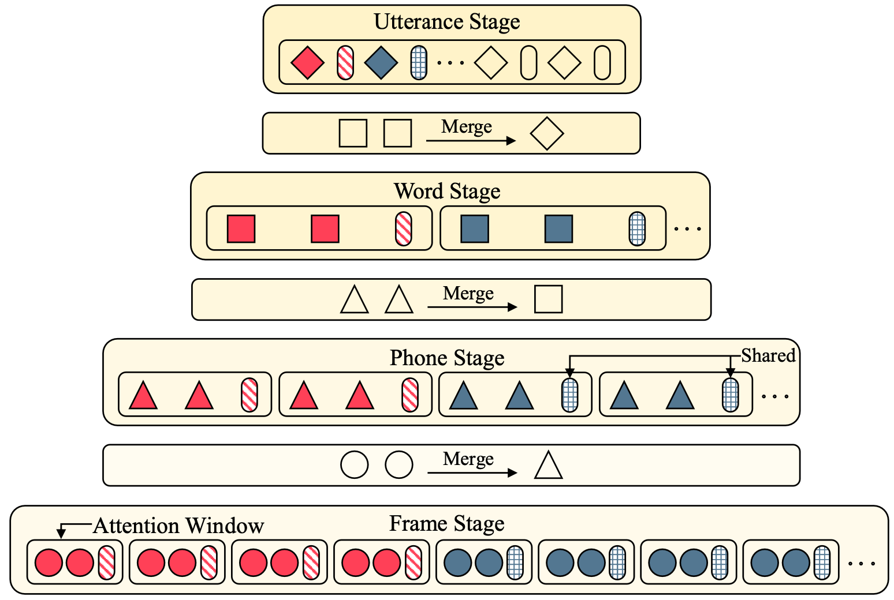

# SpeechFormer++

[\[IEEE/ACM TASLP\]](https://ieeexplore.ieee.org/abstract/document/10011559) SpeechFormer++: A Hierarchical Efficient Framework for Paralinguistic Speech Processing

## Usage
Please follow the guidelines [here](https://github.com/HappyColor/SpeechFormer).

## Citation
```
@ARTICLE{chen2023,
  author={Chen, Weidong and Xing, Xiaofen and Xu, Xiangmin and Pang, Jianxin and Du, Lan},
  journal={IEEE/ACM Transactions on Audio, Speech, and Language Processing}, 
  title={SpeechFormer++: A Hierarchical Efficient Framework for Paralinguistic Speech Processing}, 
  year={2023},
  volume={31},
  number={},
  pages={775-788},
  doi={10.1109/TASLP.2023.3235194}}
```